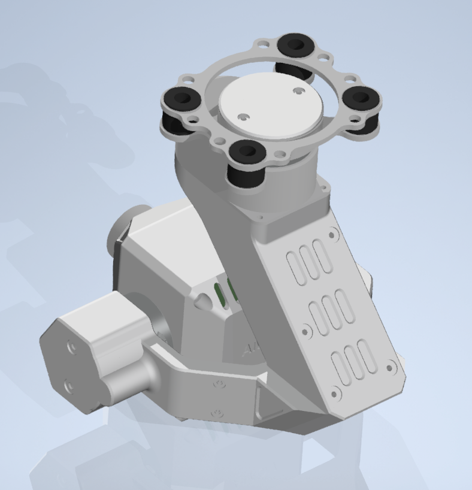
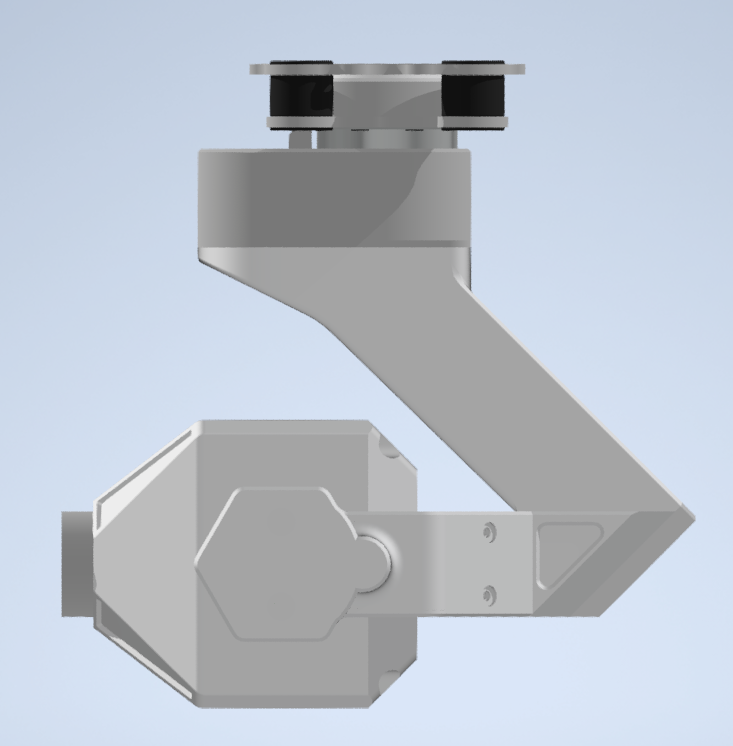
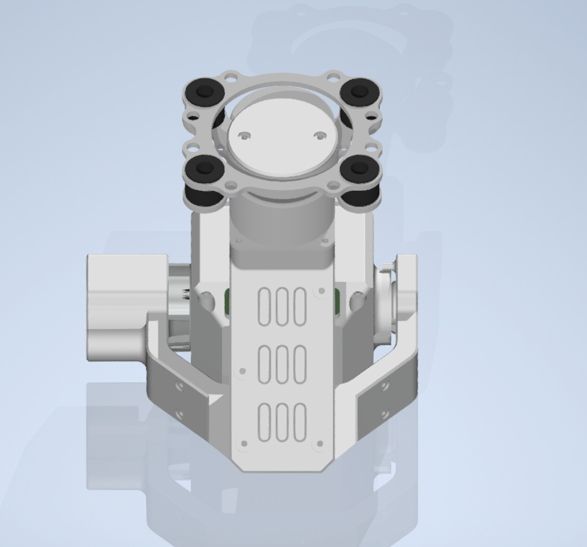
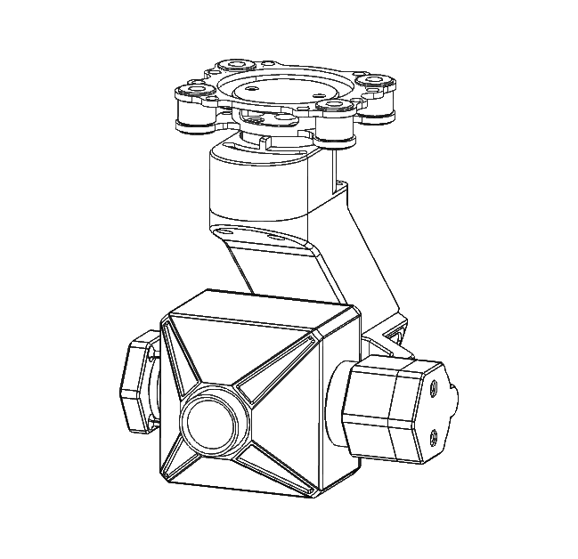
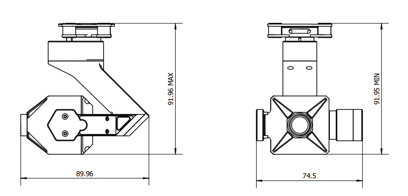

E200智能吊舱
=========================
智能吊舱=云台+相机+AI芯片+人机交互软件+深度学习

i. 产品描述
-------------

1. 可见光摄像机（MIPI相机）
  1. 支持MIPI-CSI2接口
  2. 非压缩UYVY数据格式，YUV422-8bit数据类型
  3. 200万像素SONY星光级CMOS传感器IMX327LQR-C
  4. 分辨率：1920*1080
  5. 快门类型：滚动式快门
  6. 帧率：1080p@25fps、1080p@30fps
  7. 图像增强：背光补偿、DOL-WDR、去雾
  8. 保证性能温度范围：0℃～60℃

2. 吊舱

  1. 两轴陀螺稳定位,具备对视轴进行自动稳定的能力，保持画面的稳定。
  2. 吊舱输入电压：4S
  3. 运动范围：
    1. 俯仰角动作范围：-45°~90°
    2. 偏航角动作范围：-50°~50°
  4. 吊舱重量（包含相机和控制器）：120g
  5. 吊舱尺寸：长：89.96mm 宽74.5mm高：91.96mm

3. 吊舱电气接线图
  1. 串口：主要是控制云台的运动和读取云台的状态数据
  2. 视频接口：采用的MIPI-CSI2接口，接入到jetson NX的CSI接口上

ii. 产品结构
-------------

(单位：mm)（结构尺寸）

iii. 安装说明
-------------
推荐使用P450无人机先把安装支架安装在吊舱顶部，然你把支架安装在P450无人机的正前下方

