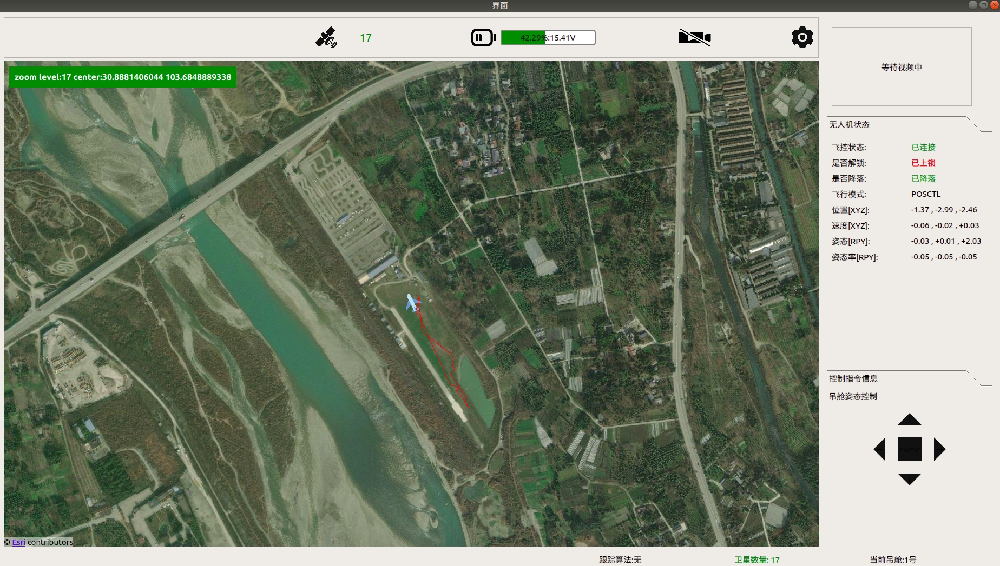
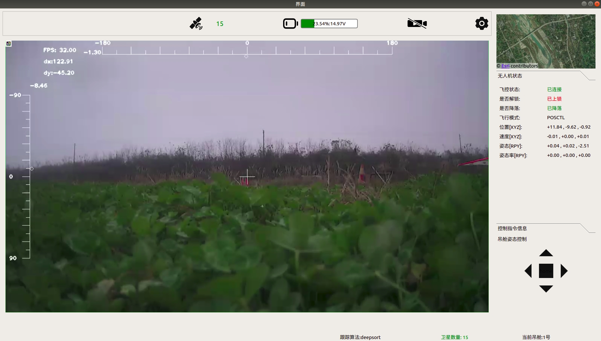
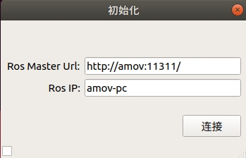

吊舱地面站
==========

i. 连接飞机
-----------

1. 地面站安装
^^^^^^^^^^^^^

​ 1）地面端环境搭建（默认存在ros环境，x86架构） ​ 打开终端输入下列指令:

::

   sudo apt-get install libgstreamer1.0-dev libgstreamer-plugins-base1.0-dev libgstreamer-plugins-bad1.0-dev gstreamer1.0-plugins-base gstreamer1.0-plugins-good gstreamer1.0-plugins-bad gstreamer1.0-plugins-ugly gstreamer1.0-libav gstreamer1.0-doc gstreamer1.0-tools gstreamer1.0-x gstreamer1.0-alsa gstreamer1.0-gl gstreamer1.0-gtk3 gstreamer1.0-qt5 gstreamer1.0-pulseaudio

   sudo apt install ros-melodic-qt-build

   sudo apt-get install qtmultimedia5-dev

   sudo apt-get install qml-module-qtpositioning

   sudo apt-get install qml-module-qtlocation

​ 2）将功能包放在/home路径下，进入功能包删除
build、devel文件夹，然后进入src路径，删除CMakeLists.txt,CMakeLists.txt.user文件，然后返回上级目录，打开终端输入指令:
**catkin_make** 进行编译。

​ 3）终端输入指令：\ **./run.sh** 运行。

2. 多机通信部署
^^^^^^^^^^^^^^^

​ 1）在\ **地面端**\ 打开终端，输入 **ifconfig**
指令查看\ **地面端IP地址**\ ，然后通过终端输入 **hostname**
指令查看\ **地面端的主机名**\ 。

​
2）通过NoMachine连接机载电脑，同样通过上述指令查看\ **空中端IP地址**\ 和\ **空中端的主机名**\ 。

​ 3）然后在\ **地面端**\ 打开终端输入指令: **sudo gedit ~/.bashrc**
然后添加如下内容:

::

   export ROS_MASTER_URI=http://空中端主机名:11311/
   export ROS_HOSTNAME=地面端主机名

​ 4）继续在\ **地面端**\ 打开终端输入指令: **sudo gedit /etc/hosts**
然后添加如下内容:

::

   空中端IP   空中端主机名       #例 192.168.31.66   amov

​ 5）通过NoMachine连接\ **机载电脑**\ ，打开终端输入指令: **sudo gedit
~/.bashrc** 然后添加如下内容:

::

   #空中端为主节点
   export ROS_MASTER_URI=http://空中端主机名:11311/
   export ROS_HOSTNAME=空中端主机名

​ 6）通过NoMachine连接\ **机载电脑**\ ，打开终端输入指令: **sudo gedit
/etc/hosts** 然后添加如下内容:

::

   地面端IP   地面端主机名       #例 192.168.31.66   amov

​ 7）配置完成可以在地面端终端 ping空中端的主机名，空中端终端
ping地面端的主机名，例:

::

   ping amov
   ping amov-pc

**注意：**\ 如果地面端ip发生变化，则需要更新空中端中存的地面端ip，空中端ip一般而言不会发生变化，如果发生了也是同样的操作。

3. 连接飞机
^^^^^^^^^^^

以上操作完成后，打开空中端的ros节点，然后打开地面站，然后更改信息

|image0|

Ros Master Url: http://**空中端主机名**\ 或者\ **空中端IP**:11311/ Ros
IP: **地面端主机名**\ 或者\ **地面端IP**

完成后点击连接。 左下角小框点击后选中环境变量可以进行单机测试。
单机测试需要屏蔽地面端 **gedit ~/.bash**
中多机配置的内容，才能启动ros节点。

ii. 界面介绍
------------

1. 加载界面
^^^^^^^^^^^

.. figure::  ../../images/gimbal_ground_station/load.jpg
   :alt: load

   load

2. 连接界面
^^^^^^^^^^^

|image1|

会保存上次连接的数据，然后会进行自动连接，连接失败后进入该界面，连接成功则进入主界面。

3. 主界面
^^^^^^^^^

   home

​ 1）窗口切换

通过点击右上角的窗口可以与中间窗口进行切换，从而达到图传窗口和地图窗口的相互切换。

   homeSwitch

​ 2）地图（中间窗口为地图时）

地图存在缓存功能，可以在有网络的情况下先缓存飞行区域地图；地图上的无人机标志会根据无人机的经纬度实时更新位置并且会产生航迹，同时也会根据无人机的偏航角信息进行地图上无人机标志的偏航。同时地图也存在拖动、缩放功能。地图左上角显示地图级数，以及目前地图中心点的经纬度。如果是正常退出会记录最后一次所在的地图中心点，再次打开地图中心会在上一次地图关闭的位置。

​ 3）图传（中间窗口为图传时）

图传窗口存在人工框选功能，当空中端运行KCF算法时，可以通过在图传窗口按下左键拖动一个红色的框然后释放左键，然后会出现一个蓝色的框表示跟踪信息已发送到空中端，同时可以通过点击右键进行取消跟踪状态。当空中端运行deepsort多目标算法时，可以通过左键点击或者长按然后释放目标框进行跟踪（点击还是长按可以通过设置进行修改，见下方设置界面），当目标框变为红色则表示空中端接收到跟踪信息，同时可以通过点击右键进行取消跟踪状态。

   deepsort

​ 3）无人机数据监控

   UAVstatus

通过观察无人机状态和控制指令的数据查看，监测无人机的实时状态，保证无人机的正常飞行。

​ 4）手动控制吊舱姿态

   shoudong

通过主界面右下方的上下左右和归中按钮进行吊舱的手动控制，手动控制过程中应该要取消跟踪状态，不然会导致手动控制过程不顺利的情况。

​ 5）录像功能

该录像功能是控制空中端的吊舱录像，达到图像清晰度的提升，开始时该图标为红色。现阶段该功能还未开发。

​ 6）无人机电量监控

通过电量条进行监控，可以通过设置进行电量最低值和最大的值的设置以及电量低于多少进行报警。

​ 7）设置

点击该按钮后，会弹出设置按钮。

​ 8）状态栏

最下方为状态栏，左下角是会显示你当前的一些操作，右下角显示跟踪算法和当前吊舱。

4. 设置界面
^^^^^^^^^^^

​ 1）通用设置

.. figure::  ../../images/gimbal_ground_station/settings.jpg
   :alt: settings

   settings

临时消息显示时长：状态栏左下角显示操作的时间。
接收数据精度：无人机状态数据显示精度 电量范围：最小电压和最大电压
电量警告：电量低于该百分比时会报警

​ 2）图传设置

.. figure::  ../../images/gimbal_ground_station/settings1.jpg
   :alt: settings1

   settings1

图传ip：填写空中端主机名或者空中端ip。
适配分辨率：空中端视频的分辨率宽高
点击倒计时：deepsort多目标跟踪算法，发起跟踪的指令，当值为正数时，左键长按倒计时完毕后产生launch字样释放鼠标即开始跟踪，值为负数时，点击即可开始跟踪。

​ 3）地图设置

.. figure::  ../../images/gimbal_ground_station/settings3.jpg
   :alt: settings3

   settings3

经纬度精度：表明无人机的经纬度传入地图中经纬度，精度越大定位越准。
无人机图标宽高：地图上无人机图标的大小。

